<p align="center">
  <picture>
    <source media="(prefers-color-scheme: dark)" srcset="docs/branding/msm-logo.svg">
    
  </picture>
</p>

# Minecraft Server Manager (MSM) 2.0

A self-hosted web panel to run **several Minecraft servers** from a single interface:
real-time console, players, mods and plugins, configuration files, events, backups,
scheduled tasks — and two-way sync with a custom launcher's modpack.

It can also be opened to other people: each account creates and runs its own servers,
within limits you set, each server confined to its own folder.

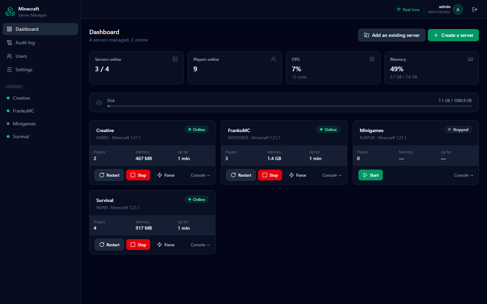

> MSM 2.0 is a complete rewrite. Version 1 (a single-server Flask script) is still
> available under the [`v1.0-legacy`](../../tree/v1.0-legacy) tag.

## Features

| | |
|---|---|
| **Multi-server** | Each server runs in its own process group with its own console. Stopping one never affects the others. |
| **Any server type** | Vanilla, Paper, Purpur, Spigot, Forge, NeoForge, Fabric, Quilt, Mohist… Nothing is hard-coded: the interface adapts to what the server folder actually contains. |
| **Create from scratch** | Pick Vanilla, Paper, Purpur, Fabric, NeoForge, Mohist or Youer and a version: MSM creates the folder, downloads and verifies the server, runs the NeoForge installer when needed, and registers it. |
| **Discord notifications** | Each server announces its crashes, starts, stops and backups in its own channel; a global channel announces server creation and deletion. |
| **Real time** | WebSocket with sequence numbers and resume after a disconnect. No polling. |
| **Survives restarts** | Restarting or updating MSM never disconnects players: running servers are re-adopted when the panel comes back. |
| **Accounts** | Sign-up with a password or with Google (closed, by invitation or open — your choice), profile with avatar, admin panel to review, ban or reinstate accounts. |
| **Per-account hosting** | Each account creates its own servers in its own folder, with a port from a reserved range and limits on servers, memory and disk. |
| **Sharing** | The owner of a server shares it with other accounts, as a member (overview only) or as a server admin. |
| **Isolation** | On Linux, the servers of user accounts run in their own systemd unit, under their own system account: only their folder is writable, the other servers and MSM are out of sight, and memory, CPU and tasks are capped. |
| **Secure** | Mandatory authentication, roles, audit log of every action, strict path confinement, no arbitrary shell commands. |
| **Portable** | Production on Linux (hardened systemd unit); development and deployment on Windows fully supported. CI runs on both. |
| **Bilingual** | English by default, French in one click from **Settings → Language** — including the messages produced by the server (errors, console notices, audit log). |

### Server overview

Live status, resource history (CPU, memory, players) and start-up settings.

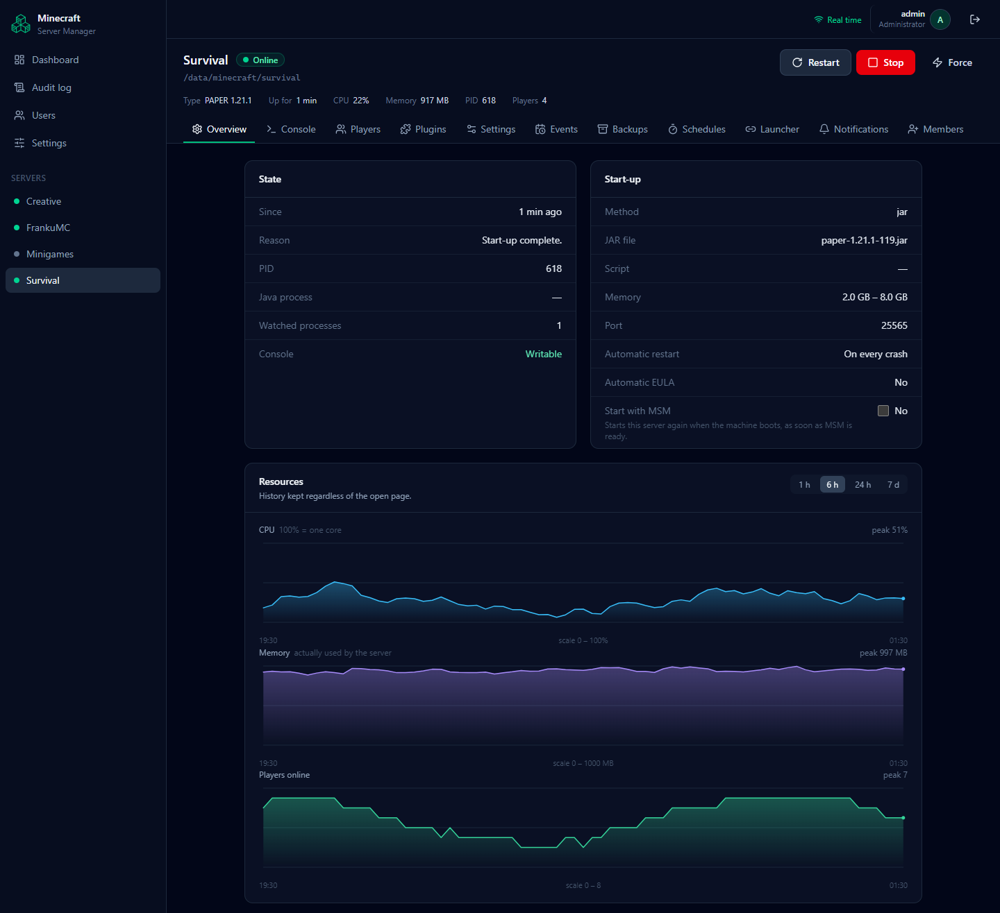

### Real-time console

Colour-coded log levels, command history, and a warning before any sensitive command.

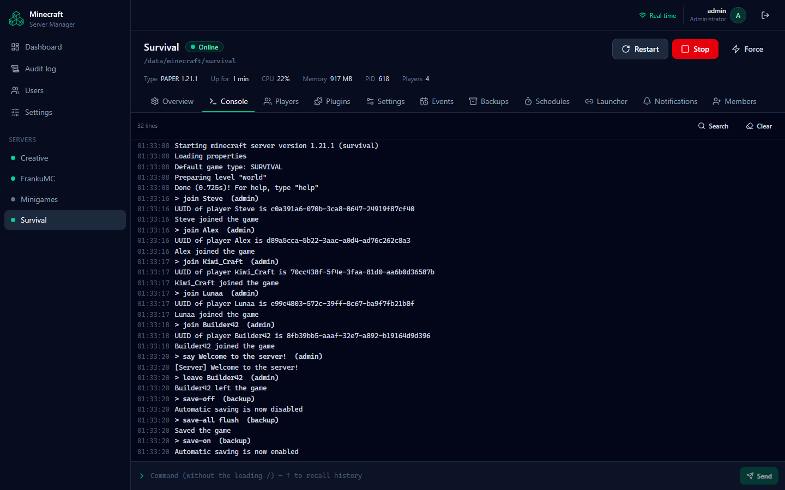

### Players

Who is online, play history, skins, operator / ban / whitelist status and moderation actions.

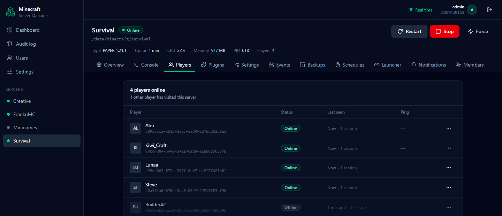

### Mods and plugins

Upload, enable or disable without deleting — a disabled mod is only renamed, so it can always be turned back on.

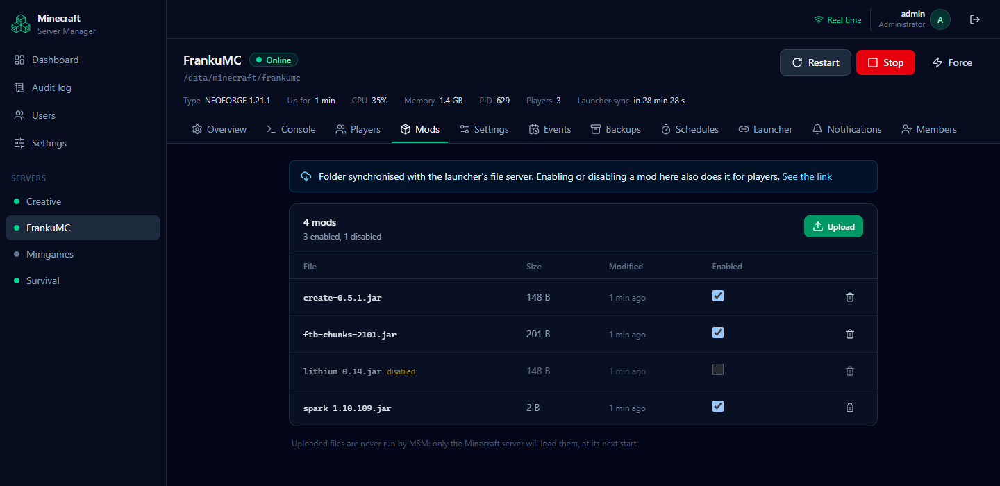

### Custom launcher integration

Link a server to your launcher's file server: its modpack is installed on the server
automatically (client-only mods excluded), and disabling a mod in MSM removes it from
the players' modpack at their next launch. A countdown shows when the next sync happens.

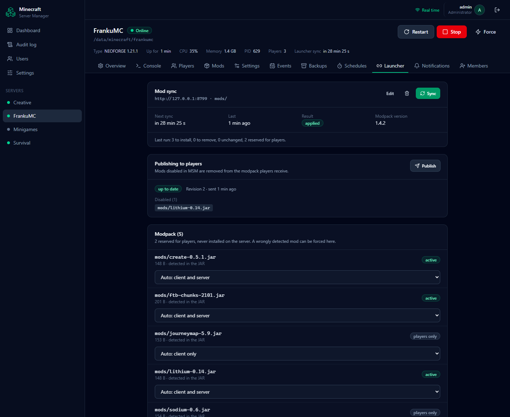

### Backups and scheduled tasks

Hot backups of worlds and configuration files (with `save-off` / `save-on`), one-click
restore, and scheduled backups, restarts or commands.

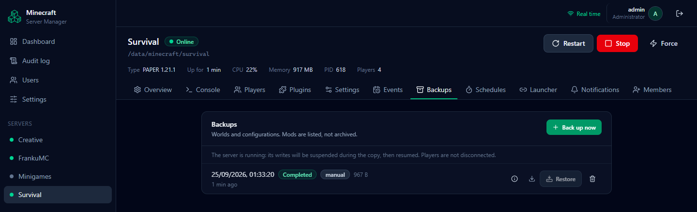

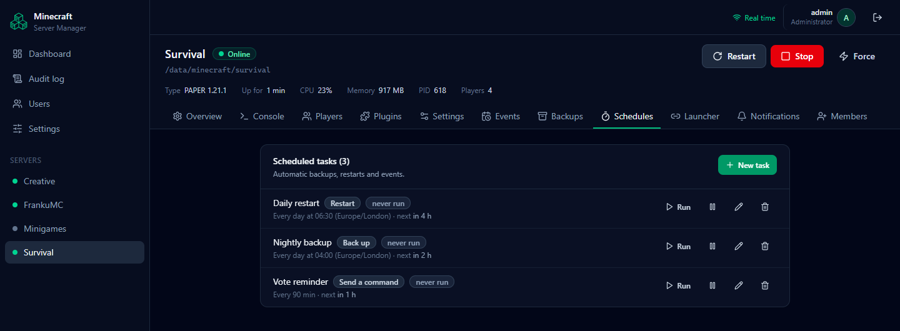

### Accounts and sharing

Anyone can find the sign-up page from the login screen; whether they may create an
account depends on the registration mode (closed, by invitation or open).

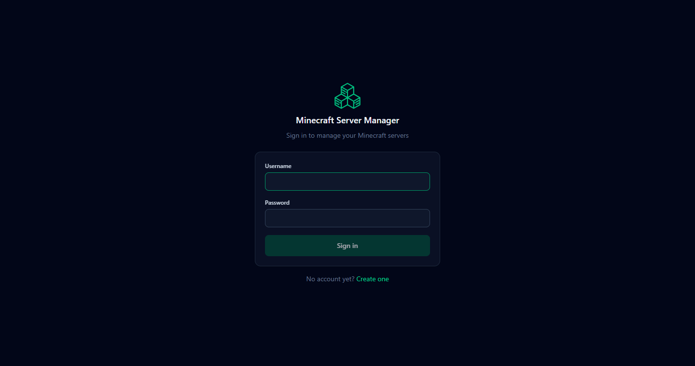

Administrators review every account — role, state, last login — and open its sheet to
see its servers, its former usernames, or to ban it.

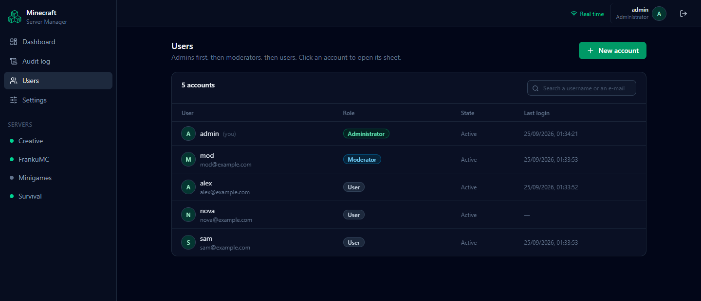

The owner of a server decides who else may see it or run it.

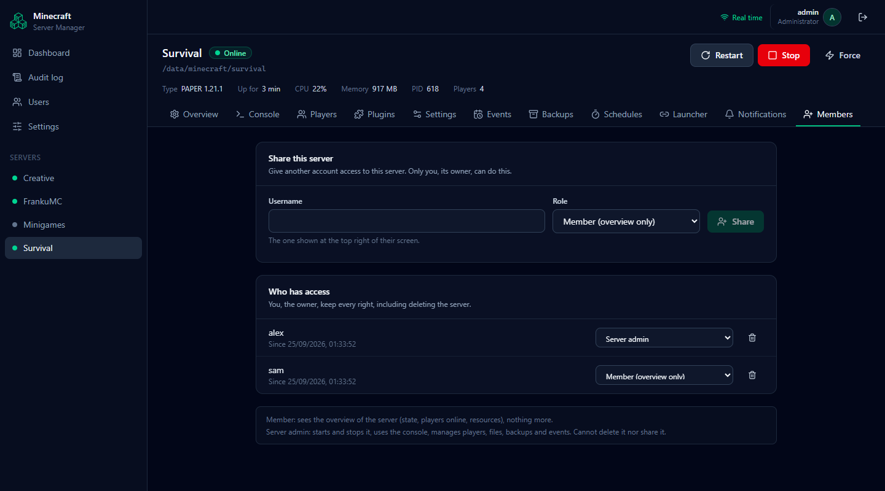

Each account manages its own profile: username, avatar, language, e-mail, password
and Google sign-in.

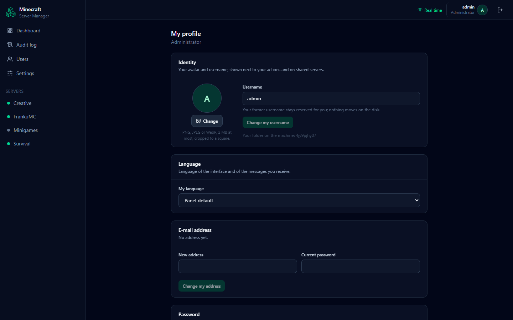

## Installation (Linux)

MSM needs Python 3.11+, and Node.js/npm to build the web interface. Java is needed
to run the Minecraft servers themselves.

```bash
git clone https://github.com/R3coNYT/Minecraft_Server_Manager.git
```

```bash
cd Minecraft_Server_Manager
```

```bash
sudo ./install.sh
```

The installer creates a dedicated system user, a hardened systemd service that starts
with the machine, the database, and the isolation of the servers of user accounts. The
panel then listens on <http://127.0.0.1:8000> — put an HTTPS reverse proxy in front of
it to reach it remotely. Options (install folder, servers root, port…):
`./install.sh --help` and [docs/DEPLOY.md](docs/DEPLOY.md).

Keep the cloned folder: it is what updates are pulled into.

### Creating the first administrator account

At the end of the installation, the installer asks for the name of the first
administrator account, then its password (typed without echo). Answer it, open the
panel and sign in.

If you skipped that question (or used `--skip-admin`), create the account afterwards:

```bash
sudo msm createadmin admin
```

Replace `admin` with the name you want; the password is asked for, twice. `msm` is
MSM's command line, installed by `install.sh`: it runs as the service does, with its
configuration. Options: `--email ADDRESS`, and `--role MODERATOR` or `--role USER` to
create another kind of account. `sudo msm --help` lists the other commands.

Other people then create their own account from the **Create one** link of the login
page — once you allow it in **Settings → Registration** (closed by default, by
invitation, or open to everyone).

## Updating

From the cloned folder:

```bash
sudo ./update.sh
```

The script pulls the latest version and installs it **without touching your data**:
configuration, database (accounts, servers, history, schedules…), backups and the
Minecraft servers themselves are kept. Running Minecraft servers keep running during
the update and are re-adopted afterwards.

Before changing anything it keeps a copy of the installed version and backs up the
database. If the new version fails to install or does not answer afterwards, the
previous version and the database are restored automatically. To go back manually:

```bash
sudo ./update.sh --rollback
```

Other options: `--ref <tag|branch>` to install a specific version, `--no-pull` to
install the code as it is in the folder, `--force` to reinstall the same version.

> Installed before `update.sh` existed? Run `git pull` once in the cloned folder, then
> `sudo ./update.sh`.

## Documentation

The interface is in English by default and can be switched to French in **Settings → Language**.
The detailed documentation is in French.

- [Architecture](docs/ARCHITECTURE.md) — complete design, technical decisions and their rationale
- [Deployment](docs/DEPLOY.md) — installation, reverse proxy, backups, updates
- [Development](docs/DEVELOPMENT.md) — local setup, tests, conventions
- [Launcher integration](docs/LAUNCHER_INTEGRATION.md) — sync protocol and the route to add to your launcher's file server

## Roadmap

- [x] **Phase 0** — foundations: configuration, logging, errors, database, CI
- [x] **Phase 1** — process manager, authentication, roles, audit, server management, real-time console, WebSocket, React interface
- [x] **Phase 2** — players: identity and history, skins, status (operator, banned, whitelist), moderation
- [x] **Phase 3** — files: mods, plugins, configuration editor, server.properties
- [x] **Phase 4** — events: immediate actions, recorded sequences, cancellable background runs
- [x] **Phase 5** — administration: hot backups of worlds and configurations, restore, resource history
- [x] **Phase 6** — extensions: scheduling, Discord notifications, version downloads, custom launcher integration
- [x] **Public opening** — sign-up (password or Google), per-user servers, sharing, admin panel, server isolation ([plan](docs/PLAN_OUVERTURE_PUBLIC.md), in French)
- [ ] **Phase 7** — agents: manage servers hosted on other machines

## License

To be defined.
